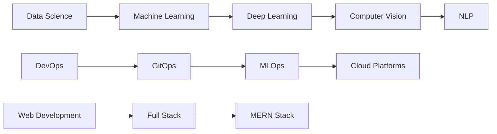

# 💫 About Me:
<div align="center">
  
</div>


### 🚀 **Current Focus**
- 🔭 Building **Emotion Detection & Song Recommendation System**
- 🌱 Mastering **GitOps & Advanced Data Science**
- 🎯 Exploring **Computer Vision & Deep Learning**
- 🤝 Open to collaborate on **IoT & AI Projects**

### 💡 **What I Do**
```python
class AnjaliThoke:
    def __init__(self):
        self.name = "Anjali Thoke"
        self.role = "Data Science Enthusiast & Python Developer"
        self.location = "India 🇮🇳"
        self.languages = ["Python", "JavaScript", "Java", "C++"]
        self.current_projects = ["Emotion Detection", "Song Recommendation"]
        self.learning = ["GitOps", "MLOps", "Deep Learning"]
        
    def say_hi(self):
        print("Thanks for dropping by! Let's build something amazing together!")

me = AnjaliThoke()
me.say_hi()
```

### 🎧 **Fun Fact**
> *I debug faster when music is playing! 🎵*

---

## 🛠️ **Tech Arsenal**

### **Languages**
<p align="left">


</p>

### **Frameworks & Libraries**
<p align="left">


</p>

### **Cloud & DevOps**
<p align="left">


</p>

### **Databases**
<p align="left">


</p>

---

## 📊 **GitHub Analytics**

<div align="center">


<br/>

</div>

---

## 🏆 **GitHub Trophies**
<div align="center">

</div>

---

## 🚀 **Featured Projects**

<div align="center">

| Project | Description | Tech Stack | Status |
|---------|-------------|------------|--------|
| 🎭 **Emotion Detection** | AI-powered facial emotion recognition system | Python, OpenCV, TensorFlow | 🚧 In Progress |
| 🎵 **Song Recommendation** | ML-based music recommendation engine | Python, Pandas, Scikit-learn | 🚧 In Progress |
| 💡 **Smart Light Sensor** | IoT-based automatic lighting system | Arduino, C++, IoT | 🔍 Seeking Collaborators |
| 🚌 **Bus Tracking System** | Real-time bus location tracking app | React, Node.js, MongoDB | 🤝 Need Help |

</div>

---

## 💻 **Coding Activity**

<div align="center">

</div>

---

## 🌟 **Current Learning Path**



---

## 📈 **Weekly Development Breakdown**

<!--START_SECTION:waka-->
```text
Python       8 hrs 32 mins   ████████████░░░░░░░░░░░░░   48.2%
JavaScript   3 hrs 15 mins   ████░░░░░░░░░░░░░░░░░░░░░   18.4%
Jupyter      2 hrs 45 mins   ███░░░░░░░░░░░░░░░░░░░░░░   15.6%
HTML/CSS     1 hr 30 mins    ██░░░░░░░░░░░░░░░░░░░░░░░    8.5%
SQL          1 hr 15 mins    █░░░░░░░░░░░░░░░░░░░░░░░░    7.1%
Others       25 mins         ░░░░░░░░░░░░░░░░░░░░░░░░░    2.2%
```
<!--END_SECTION:waka-->

---

## 🤝 **Let's Connect & Collaborate**

<div align="center">

### 💬 **Ask me about:** Git • GitHub • GitOps • Python • Data Science • Machine Learning

### 📫 **Reach me at:** [anjalithoke2@gmail.com](mailto:anjalithoke2@gmail.com)

<p align="center">
<a href="https://linkedin.com/in/anjalithoke28"></a>
<a href="https://twitter.com/anjalithoke28"></a>
<a href="https://instagram.com/anjalithoke28"></a>
<a href="mailto:anjalithoke2@gmail.com"></a>
</p>

---

<div align="center">


### ⭐ **"Code is like humor. When you have to explain it, it's bad."** ⭐

</div>

</div>

---

<div align="center">

</div>
